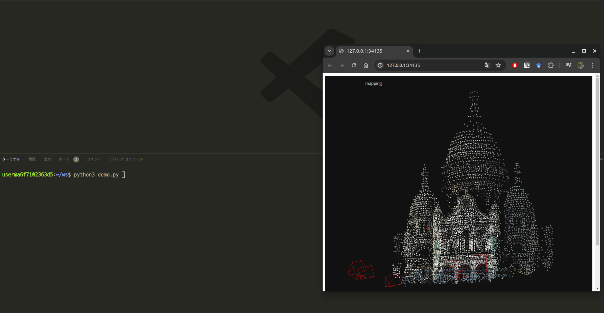

# docker_hloc

[](https://opensource.org/licenses/MIT)

Docker image for [hloc](https://github.com/cvg/Hierarchical-Localization)

<p align="center">
  
</p>

## Installation
```bash
git clone --recursive https://github.com/ToshikiNakamura0412/docker_hloc.git ~/docker_hloc
cd ~/docker_hloc
docker compose build
```

## Usage
### Start
```bash
docker compose up -d
```

### Demo
Execute the following command in the container with **VSCode**
```bash
python3 ~/ws/demo.py
```

### Stop
```bash
docker compose down
```
